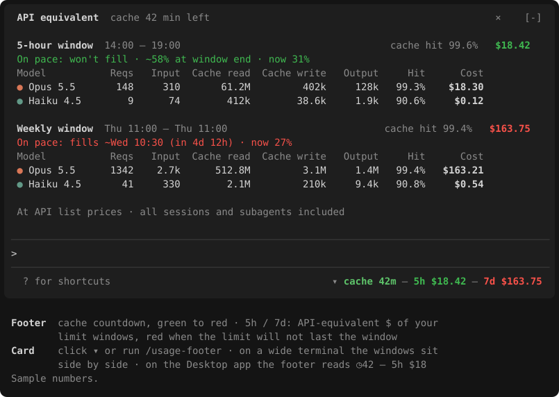

# usage-footer

A Claude Code mod that puts your usage where you look anyway: beside the model name under the prompt.



```
▾ ◷42 — 5h $82 — 7d $115
```

- **◷42**: minutes left before this session's prompt cache expires. Green while fresh, sliding through yellow to red as it runs out.
- **5h $82**: what the requests in your current 5-hour limit window would cost at API list prices.
- **7d $115**: the same for your current weekly limit window. While the session runs Fable, this slot shows Fable's own weekly window (`F $…`).

The 5h and 7d values are colored by pace: red if, at the pace so far, the limit fills before the window resets; yellow if it ends the window at 85–100%; green otherwise.

Click **▾** (or run `/usage-footer`) for a card above the prompt with, per window:

- when the limit fills at the current pace, or where it ends the window
- the total cost and the cache hit rate
- one row per model: requests, input, cache read, cache write, output, hit rate, cost

## How it works

- The windows are your account's own: each starts its length (5 hours, 7 days) before the reset time Claude Code reports for that limit, not a rolling "last 5 hours".
- Costs come from your local transcripts (`~/.claude/projects`, including subagents), across every session on this machine, deduplicated per request and priced at API list prices. It is not what a subscription charges.
- A small Node.js script scans the transcripts incrementally at the end of each turn and every 5 minutes; a scan takes tens of milliseconds. Nothing runs inside the model's request stream.

## Requirements

- Claude Code **v2.1.287** or later (mods), in the terminal or the Code tab of the Desktop app.
- **Node.js** on the machine. The mod looks for `node` on PATH, then in the usual install locations on macOS (Homebrew), Linux and Windows.
- Works on macOS, Windows and Linux.

## Install

```bash
claude plugin marketplace add omeraltinova/claude-usage-footer
claude plugin install usage-footer@claude-usage-footer
```

Then start a new session, or run `/reload-plugins` in an open one.

## Notes

- Prices are built in (`plugins/usage-footer/scripts/usage-scan.mjs`, `PRICES`) and need updating when Anthropic's prices change.
- Usage on claude.ai (web, mobile) is not in the local transcripts, so it is not counted in the dollar figures; the limit percentages come from your account and do include it.
- The Desktop app cuts the footer at a fixed width, so the footer stays short; the card has the details.

## License

MIT
